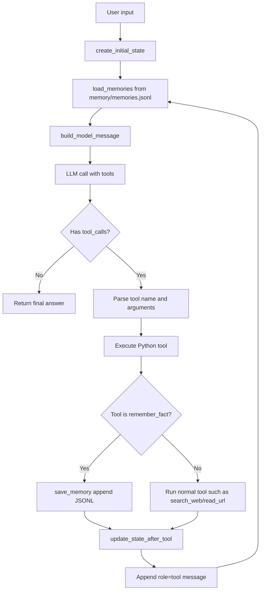

# 第四部分：Long-term Memory

前三部分已经让 Agent 具备了几个基础能力：

```text
第一部分：会循环调用 LLM
第二部分：会用正式 tool calling 调用工具
第三部分：会维护一次任务内的 state
```

第四部分开始，重点变成：

```text
Agent 如何把用户明确要求记住的信息保存到程序运行之后？
下一次启动 main.py 时，Agent 如何重新读取这些长期记忆？
这些长期记忆和第三部分的 state 有什么区别？
```

一句话总结：

```text
State 是一次运行中的工作记忆。
Long-term memory 是跨运行保存、下次还能读取的长期记忆。
```

## 1. 和第三部分 State 的区别

第三部分的 `state` 是在 `run_agent(...)` 里创建的：

```python
state = create_initial_state(user_input)
```

它的特点是：

```text
1. 只存在于这一次 run_agent 执行期间
2. 程序结束后就消失
3. 主要记录工具结果、sources、notes、errors
4. 目的是帮助当前任务继续推理
```

第四部分的 long-term memory 不一样。它保存到文件：

```text
memory/memories.jsonl
```

它的特点是：

```text
1. 程序结束后仍然存在
2. 下一次 python main.py 启动后还能读取
3. 主要保存用户明确要求记住的信息
4. 目的是影响未来对话的回答方式或背景理解
```

所以这两种 memory 的边界是：

```text
state:
  当前任务过程中的临时工作记忆

long-term memory:
  跨任务、跨程序运行的持久记忆
```

## 2. 当前实现里保存了哪些类型

`memory.py` 里定义了允许的记忆类型：

```python
ALLOWED_MEMORY_TYPES = {
    "preference",
    "profile",
    "project",
    "fact",
}
```

可以这样理解：

| 类型 | 适合保存什么 |
| --- | --- |
| `preference` | 用户偏好，比如希望用中文解释代码 |
| `profile` | 用户个人背景，比如学习阶段、技术栈 |
| `project` | 当前项目相关的长期信息 |
| `fact` | 普通可复用事实 |

你测试的这句话：

```text
请记住：我希望你以后解释代码时用中文，并说明为什么。
```

应该保存成：

```json
{
  "type": "preference",
  "content": "用户希望我在解释代码时使用中文，并且在解释时要说明代码为什么这样写..."
}
```

原因是它描述的不是某个客观事实，而是用户对以后回答方式的偏好。

## 3. 保存路径：用户请求到 memories.jsonl

保存长期记忆的流程是：

```text
User:
  请记住：我希望你以后解释代码时用中文，并说明为什么。

LLM:
  判断这是一个明确的长期记忆请求
  选择调用 remember_fact 工具

Python Agent:
  解析 tool_call.function.arguments
  执行 TOOLS["remember_fact"](args)

remember_fact:
  调用 save_memory(memory_type, content)

save_memory:
  把一行 JSON 写入 memory/memories.jsonl
```

对应代码链路：

```python
# agent.py
args = json.loads(tool_call.function.arguments or "{}")
result = TOOLS[tool_name](args)
```

```python
# tools.py
def remember_fact(args):
    memory_type = args.get("type", "fact")
    content = args.get("content")
    item = save_memory(memory_type, content)
```

```python
# memory.py
with MEMORY_FILE.open("a", encoding="utf-8") as f:
    f.write(json.dumps(item, ensure_ascii=False) + "\n")
```

这里有一个关键点：

```text
LLM 不直接写文件。
LLM 只决定要不要调用 remember_fact，以及传什么参数。
真正写文件的是 Python 里的 save_memory。
```

## 4. 读取路径：下一次启动时如何带上长期记忆

长期记忆不是自动进入模型脑子里的。

每次 `run_agent(...)` 循环时，代码都会重新读取文件：

```python
long_term_memories = load_memories()
model_message = build_model_message(messages, state, long_term_memories)
```

然后在 `build_model_message(...)` 里，把长期记忆转换成一个 system message：

```python
memory_message = {
    "role": "system",
    "content": f"Long-term memories:\n{format_memories_for_context(memories)}"
}
```

最后发给模型的消息大概是：

```text
system prompt
+ Long-term memories
+ Current explicit agent state
+ recent messages
```

所以长期记忆能生效，不是因为模型真的“记住了文件”，而是因为 Agent 每次调用 LLM 前，都把文件里的记忆重新塞回上下文。

## 5. 为什么第一个 test case 能成功

测试命令：

```bash
python main.py "我之前让你记住了什么偏好？"
```

它测试的是读取路径。

成功说明这几件事已经打通：

```text
1. memory/memories.jsonl 里已经有 preference 类型的记录
2. load_memories() 能从文件读出记忆
3. format_memories_for_context() 能把记忆转成文本
4. build_model_message() 能把记忆放进 system message
5. LLM 能根据 Long-term memories 回答用户的偏好
```

这条测试不一定需要调用工具。因为偏好已经在上下文里了，模型直接回答就可以。

## 6. 为什么第二个 test case 也重要

测试命令：

```bash
python main.py "搜索 Python requests 文档并总结"
```

它测试的是长期记忆不会破坏原来的工具调用能力。

这个任务本身需要搜索，所以 Agent 仍然应该能正常走：

```text
LLM decides to call search_web
-> Python executes search_web
-> tool result goes back into messages
-> state records search observation and sources
-> LLM summarizes result
```

这个测试说明第四部分加入 long-term memory 之后，原来的 tool calling 和 state 流程仍然能工作。

也就是说，现在的 Agent 同时具备两种记忆：

```text
long-term memory:
  提供用户偏好和长期背景

state:
  记录当前搜索任务里的工具结果
```

## 7. 当前完整流程图



这个图里最关键的是两个方向：

```text
写入方向:
  remember_fact -> save_memory -> memories.jsonl

读取方向:
  memories.jsonl -> load_memories -> memory_message -> LLM
```

## 8. 学习这一部分要抓住的重点

这一部分不要只记“写一个 JSONL 文件”。真正要理解的是：

```text
1. 长期记忆必须持久化，否则程序结束就没了
2. 持久化以后还必须重新注入 prompt，否则 LLM 看不到
3. 记忆类型是给未来检索和筛选用的，不只是装饰字段
4. 用户偏好应该保存成 preference，不应该保存成普通 fact
5. long-term memory 和 state 是互补关系，不是替代关系
```

最重要的一句话：

```text
Long-term memory = 持久化存储 + 每次调用前重新注入上下文。
```

## 9. 和前四部分连起来看

现在的学习路线可以这样串起来：

```text
第一部分：Agent Loop
让一次 LLM 调用变成多步任务执行。

第二部分：Tool Calling
让 LLM 用正式协议表达工具调用。

第三部分：State and Memory
让 Agent 整理当前任务过程中的工作记忆。

第四部分：Long-term Memory
让 Agent 把用户明确要求记住的信息保存下来，并在未来任务中重新使用。
```

最后把当前版本的 Agent 总结成一句话：

```text
Agent = LLM + tools + loop + state + long-term memory
```

