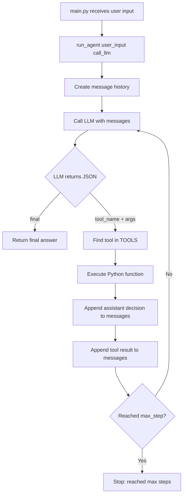

# 第一部分：最小 Agent Loop

这份笔记基于当前项目的实现，而不是框架里的抽象概念。当前代码已经实现了一个最小 agent loop：

```text
User input
-> LLM decides next action
-> Python executes tool
-> tool result
-> LLM continues
-> final answer
```

核心结论：

```text
Agent = LLM + tools + loop + state
```

在这个项目里，对应关系是：

```text
LLM   = llm.py 里的 call_llm(messages)
tools = tools.py 里的 TOOLS / TOOL_DESCRIPTIONS
loop  = agent.py 里的 for step in range(max_step)
state = agent.py 里的 messages
```

## 1. 整体流程



这个流程里最重要的一点是：LLM 不是真的执行工具。LLM 只是在输出 JSON，告诉 Python “我想调用哪个工具”。真正调用工具的是这行代码：

```python
result = TOOLS[tool_name](args)
```

## 2. Message History：Agent 的状态

当前实现里，状态不是数据库，也不是复杂 memory，而是 `messages` 这个列表：

```python
messages = [
    {"role":"system", "content": SYSTEM_PROMPT},
    {"role":"user", "content": user_input}
]
```

每一轮工具调用后，代码会继续追加消息：

```python
messages.append({"role":"assistant", "content": output})
messages.append({
    "role":"user",
    "content": f"Tool result from {tool_name}: {result}"
})
```

难点在这里：LLM 本身没有持续记忆。下一轮它之所以知道上一轮发生了什么，是因为 Python 把完整的 `messages` 再次发给它。

所以 agent loop 里的 state 本质上是：

```text
到目前为止发生过什么
```

如果没有 message history，LLM 每一轮都会像第一次被调用一样，不知道刚才调用过工具，也不知道工具返回了什么。

## 3. System Prompt：给 LLM 的规则

当前 `SYSTEM_PROMPT` 做了三件事：

1. 告诉 LLM 它是一个 agent。
2. 告诉 LLM 有哪些工具可以用。
3. 约束 LLM 必须返回 JSON。

关键内容是：

```python
When calling a tool, respond ONLY JSON:
{"tool_name":"tool_name", "args":{...}}

When finished, respond ONLY JSON:
{"final":"..."}
```

这个 prompt 是整个 agent loop 能跑起来的前提。因为 Python 后面会直接做：

```python
response = json.loads(output)
```

如果 LLM 返回普通自然语言，比如：

```text
Sure, I will call get_time.
```

程序就无法解析，会进入：

```python
except json.JSONDecodeError:
    return f"Error: LLM output is not valid JSON. Output: {output}"
```

难点：prompt 不是只影响回答风格，它在这里变成了 LLM 和 Python 程序之间的接口协议。

## 4. Tool Schema：给 LLM 看的工具说明

一句话：Tool schema 是给 LLM 看的工具说明，`TOOLS` 才是 Python 真正会执行的函数表。

```text
TOOLS              = Python 真正能执行的函数表
TOOL_DESCRIPTIONS = 给 LLM 看的工具说明
```

难点只有一个：工具说明里的参数名要和真实函数读取的参数名一致。

## 5. Tool Result：工具结果如何回到 LLM

工具调用结束后，Python 得到的是普通字符串或对象：

```python
result = TOOLS[tool_name](args)
```

但是 LLM 不会自动知道这个结果。必须把结果放回 `messages`：

```python
messages.append({
    "role":"user",
    "content": f"Tool result from {tool_name}: {result}"
})
```

这里当前实现用 `role: "user"`，是因为这个项目是在手写一个简化版 agent loop。

不要把它和 OpenAI / DeepSeek 的正式 tool calling 协议混在一起。正式协议里的 `role: "tool"` 通常需要上一条 assistant message 里有 `tool_calls`，并且 tool result 需要带 `tool_call_id`。当前项目不是那个结构，而是让 LLM 输出普通 JSON：

```json
{"tool_name":"get_time", "args":{}}
```

所以当前更适合把工具结果作为普通上下文回传：

```text
Tool result from get_time: 2026-05-29 10:30:00
```

难点：工具执行结果不是 final answer。它只是下一轮 LLM 生成 final answer 的材料。

## 6. Stop Condition：什么时候停止

当前有两个停止条件。

第一种：LLM 返回 `final`：

```python
if "final" in response:
    return response["final"]
```

这是正常停止。

第二种：超过最大轮数：

```python
for step in range(max_step):
    ...

return "Stopped: reached max steps"
```

这是安全停止。

为什么需要 `max_step`？

因为 LLM 可能一直返回工具调用，而不是返回 final：

```json
{"tool_name":"get_time", "args":{}}
```

如果没有 `max_step`，程序可能无限循环：

```text
LLM asks for tool
Python executes tool
LLM asks for tool again
Python executes tool again
...
```

难点：agent loop 必须有退出机制。否则功能越强，越容易失控、浪费 token、卡住程序。

## 7. 当前实现最重要的学习点

这个项目不是为了做一个功能很强的 agent，而是为了理解 agent 的骨架。

最重要的理解是：

```text
LLM 不执行动作，只产生下一步决策。
Python 不理解意图，只执行结构化指令。
messages 不是日志而已，它是下一轮决策的状态。
tools 不是 prompt 里的文字，而是 Python 可调用函数。
loop 让一次 LLM 调用变成多步任务执行。
stop condition 让 agent 知道什么时候结束。
```

这就是最小 agent loop 的本质。

## 8. 当前版本的边界

当前实现为了学习足够简单，但也有几个明显边界：

1. `calculator` 使用 `eval(expr)`，真实项目里不安全。
2. LLM 输出必须是严格 JSON，否则会解析失败。
3. 工具参数没有做 schema 校验。
4. 工具结果是用自然语言字符串回传给 LLM，不是正式 tool calling 协议。
5. message history 会越来越长，没有裁剪或总结。
6. 没有区分可恢复错误和不可恢复错误。

这些边界不是失败，而是下一阶段要学习的内容。第 1-2 天的重点正是先把这条主链路跑通：

```text
LLM decision -> Python action -> state update -> LLM continuation
```
