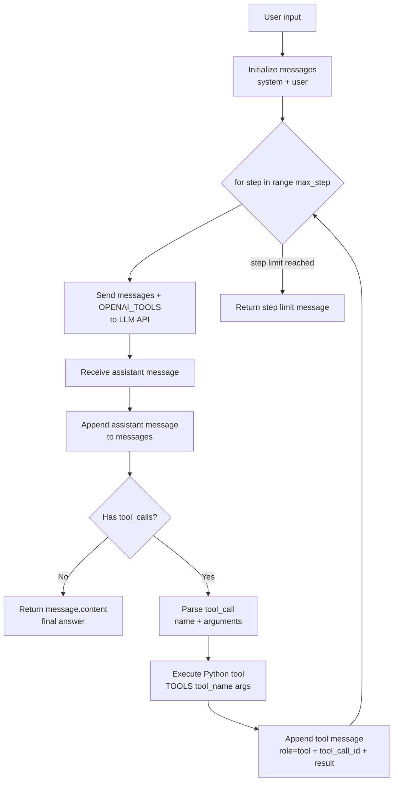

# 第二部分：正式 Tool Calling

这份笔记基于当前项目的第二版实现。第一部分里，我们手写了一个最小 agent loop：让 LLM 输出 JSON 字符串，Python 解析 JSON，再调用工具。

第二部分的重点是：现在不再让模型“假装”输出工具调用 JSON，而是使用 OpenAI / DeepSeek 兼容接口里的正式 tool calling 协议。

核心变化：

```text
第一部分：LLM 在 content 里输出 JSON 字符串
第二部分：LLM 在 message.tool_calls 里返回结构化工具调用
```

## 1. 当前流程：Agent Loop 和 Messages



这张图同时包含两件事：

```text
Agent loop = for step in range(max_step) 反复调用 LLM
Messages   = 每一轮都会把 assistant message / tool message 追加进去
```

这条链路里，LLM 仍然不真正执行工具。真正执行工具的还是 Python：

```python
result = TOOLS[tool_name](args)
```

但和第一部分不同的是，LLM 的“工具调用意图”不再藏在普通文本里，而是出现在 SDK message 对象的 `tool_calls` 字段里。

其中 `tool message with tool_call_id` 指的是：

```text
tool message with tool_call_id
= Python tool code 执行完之后的结果
= Agent 把这个结果包装成 role="tool" 的 message
= 再放回 messages，发给 LLM
```

也就是说，`tool` message 不是 LLM 生成的，而是 Python Agent 生成的。

最重要的是看 `messages` 的变化：

```text
第 1 次调用 LLM:
[
  system message,
  user message
]

LLM 要调用工具后:
[
  system message,
  user message,
  assistant message with tool_calls
]

Python 执行工具后:
[
  system message,
  user message,
  assistant message with tool_calls,
  tool message with tool_call_id
]

第 2 次调用 LLM:
把上面完整 messages 再发给 LLM，让它基于工具结果继续回答。
```

对应到代码，就是 `agent.py` 里的：

```python
for step in range(max_step):
    message = call_llm(messages)
    messages.append(message.model_dump(exclude_none=True))
    ...
    messages.append({
        "role": "tool",
        "tool_call_id": tool_call.id,
        "content": result,
    })
```

## 2. llm.py：把工具 schema 交给模型

当前 `call_llm` 的关键变化在这里：

```python
res = client.chat.completions.create(
    model="deepseek-v4-pro",
    messages=messages,
    tools=OPENAI_TOOLS,
    tool_choice="auto",
    temperature=0,
)
```

这里的 `tools=OPENAI_TOOLS` 是正式 tool calling 的入口。它告诉模型：

```text
你可以使用这些工具。
每个工具叫什么名字。
每个工具需要什么参数。
参数必须符合什么 JSON schema。
```

`tool_choice="auto"` 表示让模型自己判断：

```text
需要工具 -> 返回 tool_calls
不需要工具 -> 直接返回 content
```

所以第二部分里，system prompt 不再需要强迫模型说：

```text
When calling a tool, respond ONLY JSON
```

因为“工具调用格式”已经变成 API 协议的一部分，而不是纯 prompt 约束。

## 3. 为什么 call_llm 要返回完整 message

当前 `agent.py` 需要访问：

```python
message.tool_calls
message.content
message.model_dump(exclude_none=True)
```

所以 `llm.py` 必须返回完整 message 对象：

```python
return res.choices[0].message
```

如果只返回：

```python
return res.choices[0].message.content
```

那么 `agent.py` 拿到的就是字符串，后面会报错：

```text
AttributeError: 'str' object has no attribute 'model_dump'
```

这是第二部分最容易踩的坑：正式 tool calling 里，assistant message 不只是文本，它还可能携带 `tool_calls`。

## 4. tools.py：两张表分别给谁看

当前项目里有两张工具表：

```python
TOOLS = {
    "get_time": get_time,
    "calculator": calculator,
    "search_web": search_web,
    "read_url": read_url,
    "save_note": save_note,
}
```

```python
OPENAI_TOOLS = [
    {
        "type": "function",
        "function": {
            "name": "search_web",
            "description": "...",
            "parameters": {...},
        },
    },
    ...
]
```

它们的职责不同：

```text
OPENAI_TOOLS = 给模型看的工具说明和参数 schema
TOOLS        = Python 真正执行工具时用的函数映射表
```

这两个地方必须保持一致，尤其是工具名：

```text
OPENAI_TOOLS 里的 function.name
必须能在 TOOLS 里找到同名函数
```

否则模型可能返回：

```json
{"name": "search_web"}
```

但 Python 执行时找不到对应函数，只能返回 `tool_not_found`。

## 5. agent.py：正式 tool calling 的核心逻辑

### 5.1 先把 assistant message 放进 messages

```python
messages.append(message.model_dump(exclude_none=True))
```

这一步很重要。正式 tool calling 协议要求下一轮上下文里保留 assistant 的 tool call 决策。

也就是说，message history 里必须先有类似这样的 assistant message：

```json
{
  "role": "assistant",
  "tool_calls": [
    {
      "id": "call_xxx",
      "type": "function",
      "function": {
        "name": "search_web",
        "arguments": "{\"query\":\"...\"}"
      }
    }
  ]
}
```

然后才能追加 tool result。

### 5.2 没有 tool_calls 就是最终回答

```python
if not message.tool_calls:
    return message.content or ""
```

这就是第二部分的停止条件之一：

```text
assistant message 没有 tool_calls
= 模型认为不需要继续调用工具
= 当前 content 就是最终答案
```

第一部分里是判断 JSON 里有没有 `final`：

```python
if "final" in response:
    return response["final"]
```

第二部分里这个判断变成了：

```python
if not message.tool_calls:
    return message.content or ""
```

### 5.3 从 tool_call 中取工具名和参数

```python
tool_name = tool_call.function.name
args = json.loads(tool_call.function.arguments or "{}")
```

这里有一个容易混淆的点：

```text
tool_call 是结构化对象
但 function.arguments 通常仍然是 JSON 字符串
```

所以 Python 仍然需要 `json.loads` 把参数字符串转成 dict。

### 5.4 把工具结果用 role=tool 回传

```python
messages.append({
    "role": "tool",
    "tool_call_id": tool_call.id,
    "content": result,
})
```

这就是正式 tool calling 和第一部分最大的不一样。

第一部分里工具结果是这样回传的：

```python
messages.append({
    "role": "user",
    "content": f"Tool result from {tool_name}: {result}"
})
```

那是一种简化模拟：把工具结果伪装成普通用户消息，告诉模型“刚才工具返回了什么”。

第二部分里工具结果必须使用：

```text
role = "tool"
tool_call_id = 对应 assistant tool_call 的 id
content = 工具执行结果
```

`tool_call_id` 的作用是建立一一对应关系：

```text
assistant 请求了哪个工具调用
tool 消息就回答哪个工具调用
```

如果 assistant 一次返回多个 tool calls，这个 id 就非常关键。

## 6. 和第一部分的关键对比

| 对比点 | 第一部分：最小 Agent Loop | 第二部分：正式 Tool Calling |
|---|---|---|
| 工具调用格式 | 模型在 `content` 里输出 JSON 字符串 | 模型在 `message.tool_calls` 里返回结构化调用 |
| 工具说明位置 | 写进 system prompt / `TOOL_DESCRIPTIONS` | 通过 API 参数 `tools=OPENAI_TOOLS` 传入 |
| 参数约束 | 主要靠 prompt 约束 | 通过 JSON schema 描述参数 |
| 判断是否调用工具 | `json.loads(output)` 后看 `tool_name` | 看 `message.tool_calls` 是否存在 |
| 判断是否结束 | JSON 里有 `final` | 没有 `tool_calls`，返回 `message.content` |
| 工具结果回传 | 用 `role: user` 普通文本回传 | 用 `role: tool` + `tool_call_id` 回传 |
| 对模型输出的要求 | 必须严格输出 JSON，否则解析失败 | SDK/API 返回结构化 message，稳定性更好 |
| Python 仍负责什么 | 查 `TOOLS`、执行函数、更新 messages | 仍然查 `TOOLS`、执行函数、更新 messages |

最重要的对比结论：

```text
第一部分是在 prompt 层模拟 tool calling。
第二部分是在 API 协议层使用 tool calling。
```

## 7. 第二部分没有改变的本质

虽然接口变正式了，但 agent 的本质没有变：

```text
LLM 决定下一步
Python 执行动作
工具结果回到 messages
LLM 基于新状态继续推理
```

所以第一部分学到的骨架仍然成立：

```text
Agent = LLM + tools + loop + state
```

第二部分只是把其中的“LLM 如何表达工具调用”升级了：

```text
从 content JSON
升级为
message.tool_calls
```

## 8. 当前版本的边界

当前代码已经能表达正式 tool calling 的主链路，但还有几个值得注意的边界：

1. `calculator` 仍然使用 `eval(expr)`，真实项目里不安全。
2. `tool_call.function.arguments` 解析失败时会返回错误结果，但当前打印 `args` 的逻辑可能残留上一轮变量，后续可以单独整理。
3. `OPENAI_TOOLS` 和 `TOOLS` 需要人工保持同步。
4. 工具函数内部参数读取仍然可能抛异常，比如缺少 `query`、`url`、`title`、`content`。
5. message history 会持续增长，还没有裁剪、总结或持久化。
6. 当前 `search_web` / `read_url` 依赖网络环境，工具失败时需要模型根据错误决定是否继续。

这些边界不影响学习主线。第二部分最重要的是理解正式 tool calling 的消息结构：

```text
assistant message with tool_calls
-> Python executes function
-> tool message with tool_call_id
-> assistant final answer
```

## 9. 一句话总结

第一部分让我们看清楚 agent loop 的骨架；第二部分让这个骨架接上了正式 tool calling 协议。

更具体地说：

```text
第一部分重点：自己定义 LLM 和 Python 之间的 JSON 协议。
第二部分重点：使用模型 API 提供的 tool_calls 协议。
```

但无论哪一种，关键都不是“模型会使用工具”，而是：

```text
模型提出工具调用请求，Python 执行工具，然后把结果放回上下文。
```
